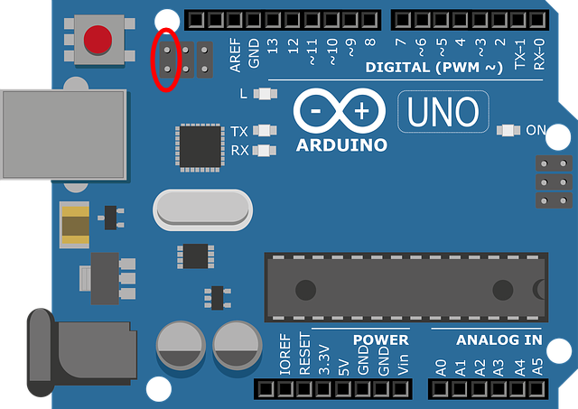

# ArduDucky

Script para reprogramar ADUINO UNO como dispositivo HID.

# Modo bootloader
El modo bootloader permite establecer un firmware diferente en Arduino. El objetivo es reprogramar Arduino para que trabaje como un teclado.

Para entrar en este modo, se deben puentear los dos ponines que se muestran marcados en la imagen:



Una vez encendido Arduino con este puente, se debe quitar el puente para que el dispositivo se reinice en modo bootloader.

## Instalar programador
Se necesita instalar el programador con la siguiente instrucción:

```
sudo apt install dfu-programmer
```

## Programar como teclado

Establezca permisos de ejecución al archivo script_hid.sh

```bash
chmod +x script_hid.sh
```

Ejecute el script y siga los pasos:

```bash
sudo ./script_hid.sh
```

> **Nota**: Antes de programar su Arduino para que funcione como un teclado, debe haber cargado en el un script compatible para realizar las pulsaciones de tecla. Existe un ejemplo en el directorio AduinoUNO

## Restablecer Arduino

Establezca permisos de ejecución al archivo script_hid.sh

```bash
chmod +x script_reset.sh
```

Ejecute el script y siga los pasos:

```bash
sudo ./script_reset.sh
```